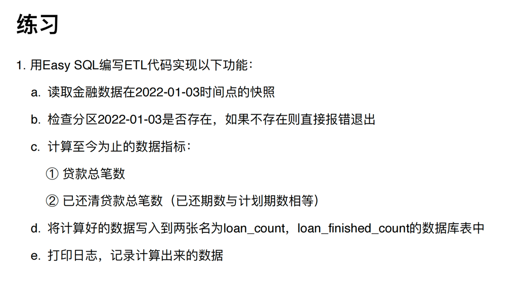

https://github.com/easysql/easy_sql



```

export PYTHONPATH=/app/dataplat/lib/deps.zip

python3 data_process.py --help

python3 data_process.py -f test.sql -d 20220101 -n test -t test -p

bash -C "$(python3 data_process.py -f test.sql -d 20220101 -n test -t test -p)"

```